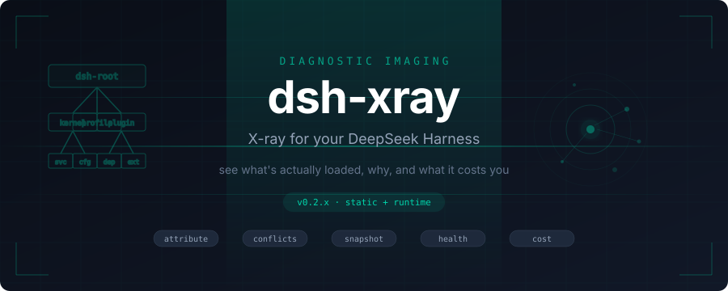
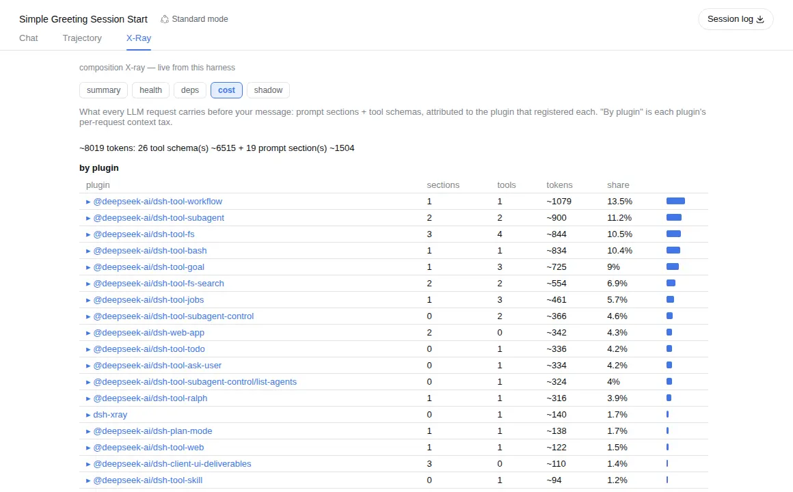
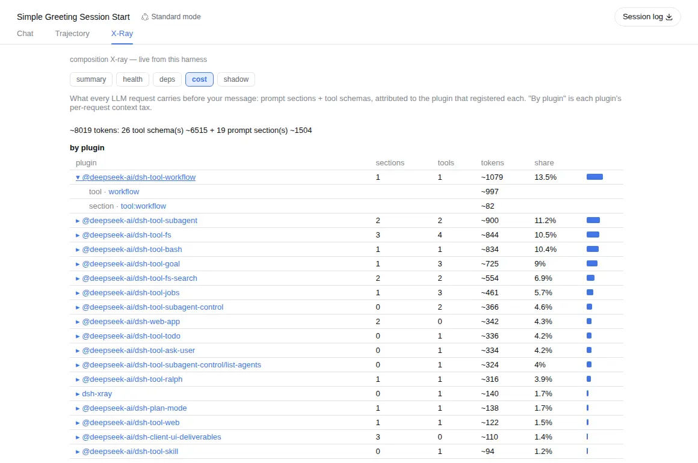
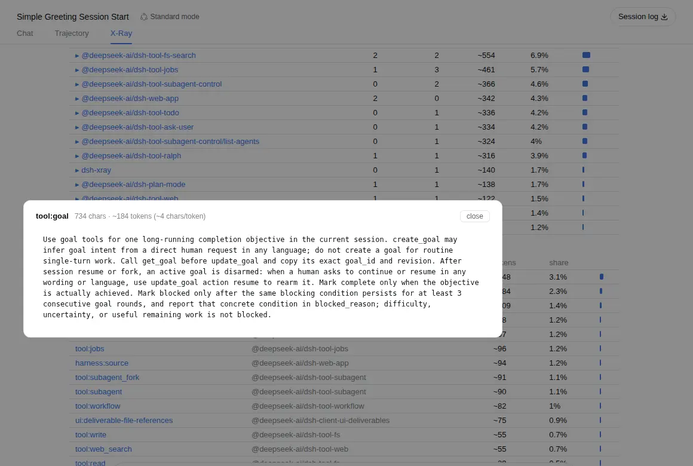
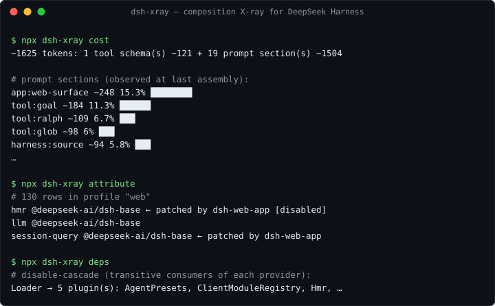

<p align="center">
  
</p>

<p align="center">
  <a href="https://www.npmjs.com/package/dsh-xray"></a>
  <a href="https://github.com/alloevil/dsh-xray/actions/workflows/check.yml"></a>
  <a href="./LICENSE"></a>
  <a href="https://scorecard.dev/viewer/?uri=github.com/alloevil/dsh-xray"></a>
  <a href="https://codecov.io/gh/alloevil/dsh-xray"></a>
  
</p>

<p align="center">
  <strong>X-ray for your <a href="https://github.com/deepseek-ai/deepseek-harness">DeepSeek Harness</a></strong> — see what's actually loaded, why, and what it costs you.
  <br>
  <em>LLM context-cost observability: token attribution per plugin, prompt-section and tool-schema pricing, skill catalog tax, dependency cascades.</em>
</p>

<p align="center">
  <a href="./README.zh.md">🇨🇳 中文文档</a>
</p>

---

Every plugin you mount quietly bills every LLM request: prompt sections, tool schemas, tokens. dsh-xray sits inside your running harness as an **X-Ray tab beside Chat and Trajectory** and itemizes that bill — per plugin, per entry, down to the exact text:



Unfold a plugin to see what it registered; click any entry to read the exact text it puts into every request:

<table>
<tr>
<td width="50%">



</td>
<td width="50%">



</td>
</tr>
</table>

Three clicks: plugin rollup → entry list → the actual words. The number stops being an estimate you trust and becomes a fact you checked.

---

## The Problem

`dsh --dump-config` shows you the composed tree. The plugin panel shows you a flat list. Neither tells you **why** a plugin is there, **what breaks** if you disable it, or **what it silently costs you** on every single request.

**dsh-xray does.** And when the answer is "this plugin taxes every request and nothing depends on it" — the `deps` view confirms the disable is safe, one patch line removes it, and `attribute` verifies it took.

---

<p align="center">
  
</p>

The cost view answers the question no other tool asks: **who put this in my context, and what does it cost?**

- **Attribution** — every prompt section and tool schema is joined to the plugin that registered it, reconstructed live from the registries (ambiguous entries stay `unattributed`, never guessed).
- **By-plugin rollup** — each plugin's per-request context tax: sections + schemas + tokens + share, ranked.
- **Entry inspection** — `/xray/api/entry` returns any entry's live text with a chars/tokens ruler. Computed per request, never persisted.
- **Skill cost** — a dedicated view prices every skill twice: its catalog line (resident on every request once any model-invocable skill exists) and its body (billed per load). Pricing only — toggling belongs to the ecosystem's skill managers.
- **Explained UI** — every view opens with a one-line "what am I looking at"; terms carry plain-language tooltips; the whole tab is localized (English / 中文) through the host locale service.

The same data flows through three surfaces: the **X-Ray tab** (native GUI), the standalone **`/xray` page** (works even when the client-module pipeline it diagnoses is broken), and the **CLI**.

---

<p align="center">
  
</p>

```sh
npx dsh-xray attribute   # which layer introduced each row, and who patched it since
npx dsh-xray conflicts   # rows whose fields have multiple writers, and who wins
npx dsh-xray diff        # declared (static layers) vs actual (dump-config) tree
npx dsh-xray snapshot    # content-addressed lockfile of the effective composition
npx dsh-xray deps [svc]  # service dependency graph: providers, consumers, disable-cascade
npx dsh-xray health      # plugin lifecycle health: failed fibers, pending injects, transitions
npx dsh-xray cost        # context cost: prompt sections + tool schemas, estimated tokens
npx dsh-xray shadow      # services provided by multiple plugins
npx dsh-xray audit       # static scan of out-of-tree plugins for sensitive touchpoints
```



`attribute`, `conflicts`, and `snapshot` are fully static — they work even when dsh cannot boot. All commands take `--profile <name>` (default `web`) and `--json`; `diff` and `health` exit `1` on drift/unhealth, so they slot into CI.

---

<p align="center">
  
</p>

<table>
<tr>
<td width="50%">

### 🔍 Layer Attribution
Which layer introduced each active plugin: kernel bundle, profile dependency, `cordis.patch.yml` insert, or repository source.

### 📊 Declared vs. Actual Diff
Installed-but-inactive, uninstalled-but-lingering patch rows — including patch rows targeting ids that don't exist (dsh skips them silently).

### ⚡ Conflict Detection
Plugins patching the same config row, and which one silently wins.

### 📸 Composition Snapshot
Export the effective composition as a lockfile; reproduce it elsewhere, diff against it later.

</td>
<td width="50%">

### 🌐 Service Dependency Graph
Who provides and consumes each service — and the **disable-cascade**: exactly which dependents go down if you disable X.

### 💊 Runtime Health
Per-plugin fiber lifecycle state, startup failures, pending injects, transition history.

### 👥 Service Shadowing
Same-name registrations where a later writer silently wins — usually an intended override, occasionally a conflict.

### 🛡️ Capability Audit
Heuristic static scan of out-of-tree plugins: network egress, shell, filesystem, env, eval.

</td>
</tr>
</table>

---

<p align="center">
  
</p>

Mounted in the tree, dsh-xray registers an `xray_composition` tool (`view: summary | deps | health | cost | shadow`), so an agent can answer:

> *"What capabilities do I have?" / "What plugin provides X?" / "Why is Y unavailable?"*

— about itself.

---

<p align="center">
  
</p>

**dsh-xray reads; it never runs.**

- Loader `!!js` expressions in patch files are parsed as opaque markers and **never evaluated**
- The CLI **never executes** plugin code (`audit` is a pattern scan over source text)
- The mounted plugin writes only under `$DSH_HOME/xray/` — entry text is served live, **never persisted**
- The entry endpoint returns composition-layer text only, **never session messages**
- See [SECURITY.md](./SECURITY.md)

---

<p align="center">
  
</p>

Two ways to use it — they're independent:

**1. Static CLI only** (no install into dsh; works even when dsh cannot boot):

```sh
npx dsh-xray attribute        # requires Node >= 22
```

**2. Mount the plugin** (adds the runtime commands, the X-Ray tab, the `/xray` panel, and the agent tool):

```sh
dsh plugin --profile web add dsh-xray
# bundle plugins take effect on the next start — restart dsh web
```

Verify it took:

```sh
dsh --profile web --dump-config | grep dsh-xray   # row present in the composed tree
npx dsh-xray health                               # reads the runtime snapshot
# then open any session and click the X-Ray tab,
# or http://localhost:3080/xray for the standalone panel
```

Uninstall: `dsh plugin --profile web remove dsh-xray`.

| Command | Behavior |
| --- | --- |
| `diff` | Exits `1` when the trees disagree |
| `health` | Exits `1` when any plugin is unhealthy |
| `attribute`, `conflicts`, `snapshot` | Fully static — work even when dsh cannot start |
| `deps`, `health` | Read runtime snapshot at `$DSH_HOME/xray/runtime.json` |

---

<p align="center">
  
</p>

Diagnostic imaging for a running composition — complementary to [dsh-doctor](https://www.npmjs.com/package/dsh-doctor) (rescue & recovery).

| Feature | Category |
| --- | --- |
| Context-tax attribution & entry inspection | 💰 Optimization |
| Skill cost (catalog line + body pricing) | 💰 Optimization |
| Layer attribution | 🔍 Inspection |
| Declared vs. actual diff | 🔍 Inspection |
| Conflict detection | 🔍 Inspection |
| Composition snapshot | 📦 Export |
| Service dependency graph | 🌐 Runtime |
| Runtime health | 🌐 Runtime |
| Service shadowing | 🌐 Runtime |
| Agent self-introspection | 🤖 AI |
| Capability audit | 🛡️ Security |

---

## License

[MIT](./LICENSE)
