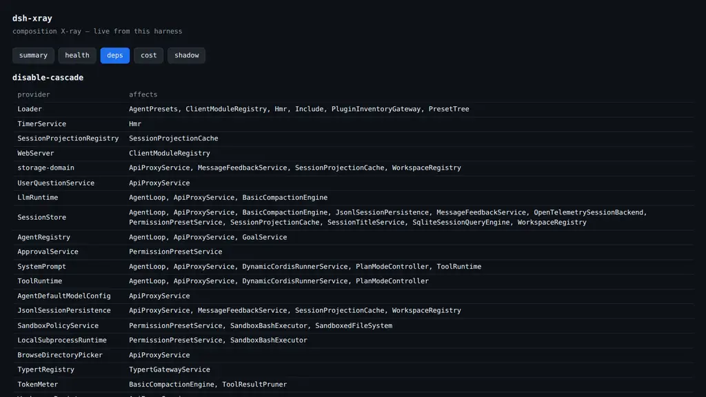

<p align="center">
  
</p>

<p align="center">
  <a href="https://www.npmjs.com/package/dsh-xray"></a>
  <a href="https://github.com/alloevil/dsh-xray/actions/workflows/check.yml"></a>
  <a href="./LICENSE"></a>
  <a href="https://scorecard.dev/viewer/?uri=github.com/alloevil/dsh-xray"></a>
  <a href="https://codecov.io/gh/alloevil/dsh-xray"></a>
  
</p>

<p align="center">
  <strong>X-ray for your <a href="https://github.com/deepseek-ai/deepseek-harness">DeepSeek Harness</a></strong> — see what's actually loaded, why, and what it costs you.
</p>

<p align="center">
  <a href="./README.zh.md">🇨🇳 中文文档</a>
</p>


---

## The Problem

`dsh --dump-config` shows you the composed tree. The plugin panel shows you a flat list. Neither tells you **why** a plugin is there, **what breaks** if you disable it, or **what it silently costs you**.

**dsh-xray does.**

> Static commands work even when dsh cannot boot; `deps`/`health`/`cost`/`shadow` and the agent tool need the plugin mounted.

---

<p align="center">
  
</p>

```sh
npx dsh-xray attribute   # which layer introduced each row, and who patched it since
npx dsh-xray conflicts   # rows whose fields have multiple writers, and who wins
npx dsh-xray diff        # declared (static layers) vs actual (dump-config) tree
npx dsh-xray snapshot    # content-addressed lockfile of the effective composition
npx dsh-xray deps [svc]  # service dependency graph: providers, consumers, disable-cascade
npx dsh-xray health      # plugin lifecycle health: failed fibers, pending injects, transitions
npx dsh-xray cost        # context cost: prompt sections + tool schemas, estimated tokens
npx dsh-xray shadow      # services provided by multiple plugins
npx dsh-xray audit       # static scan of out-of-tree plugins for sensitive touchpoints
```

<p align="center">
  
</p>

<table>
<tr>
<td width="50%">

### 🔍 Layer Attribution
Which layer introduced each active plugin: kernel bundle, profile dependency, `cordis.patch.yml` insert, or repository source.

### 📊 Declared vs. Actual Diff
Installed-but-inactive, uninstalled-but-lingering patch rows — all surfaced.

### ⚡ Conflict Detection
Plugins patching the same config row, and which one silently wins.

### 📸 Composition Snapshot
Export the effective composition as a lockfile; reproduce it elsewhere.

</td>
<td width="50%">

### 🌐 Service Dependency Graph
Who provides and consumes each service; what cascades if you disable X.

### 💊 Runtime Health
Per-plugin fiber lifecycle state, startup failures, transition history.

### 🤖 Agent Self-Introspection
The `xray_composition` tool lets agents inspect their own capability set.

### 🖥️ Web Panel
Mounted in `dsh web`, the plugin serves a zero-dependency panel at **`/xray`** — summary, health, deps (with the disable-cascade table), cost, and shadow views, live from the running composition. JSON endpoints under `/xray/api/*` serve the same data.



What every request actually carries — prompt sections observed at assembly, blended with tool schemas:

```console
$ npx dsh-xray cost
~1625 tokens: 1 tool schema(s) ~121 + 19 prompt section(s) ~1504

# prompt sections (observed at last assembly):
app:web-surface                  ~248     15.3%   ████████
tool:goal                        ~184     11.3%   ██████
tool:ralph                       ~109     6.7%    ███
harness:source                   ~94      5.8%    ███
...
```

And when a patch row targets an id that doesn't exist (dsh skips it silently), `diff` catches it:

### 🛡️ Capability Audit
Heuristic static scan: network egress, shell, filesystem, env, eval.

</td>
</tr>
</table>

<p align="center">
  
</p>

Mounted in the tree, dsh-xray registers an `xray_composition` tool (`view: summary | deps | health | cost | shadow`), so an agent can answer:

> *"What capabilities do I have?" / "What plugin provides X?" / "Why is Y unavailable?"*

— about itself.

---

<p align="center">
  
</p>

**dsh-xray reads; it never runs.**

- Loader `!!js` expressions in patch files are parsed as opaque markers and **never evaluated**
- The CLI **never executes** plugin code (`audit` is a pattern scan over source text)
- The mounted plugin writes only under `$DSH_HOME/xray/`
- See [SECURITY.md](./SECURITY.md)

---

<p align="center">
  
</p>

Two ways to use it — they're independent:

**1. Static CLI only** (no install into dsh; works even when dsh cannot boot):

```sh
npx dsh-xray attribute        # requires Node >= 22
```

**2. Mount the plugin** (adds the runtime commands, the `/xray` panel, and the agent tool):

```sh
dsh plugin --profile web add dsh-xray
# bundle plugins take effect on the next start — restart dsh web
```

Verify it took:

```sh
dsh --profile web --dump-config | grep dsh-xray   # row present in the composed tree
npx dsh-xray health                               # reads the runtime snapshot
# then open http://localhost:3080/xray for the live panel
```

Uninstall: `dsh plugin --profile web remove dsh-xray`.

All commands take `--profile <name>` (default `web`) and `--json`.

| Command | Behavior |
| --- | --- |
| `diff` | Exits `1` when the trees disagree |
| `health` | Exits `1` when any plugin is unhealthy |
| `attribute`, `conflicts`, `snapshot` | Fully static — work even when dsh cannot start |
| `deps`, `health` | Read runtime snapshot at `$DSH_HOME/xray/runtime.json` |

---

<p align="center">
  
</p>

Diagnostic imaging for a running composition — complementary to [dsh-doctor](https://www.npmjs.com/package/dsh-doctor) (rescue & recovery).

| Feature | Category |
| --- | --- |
| Layer attribution | 🔍 Inspection |
| Declared vs. actual diff | 🔍 Inspection |
| Conflict detection | 🔍 Inspection |
| Composition snapshot | 📦 Export |
| Service dependency graph | 🌐 Runtime |
| Runtime health | 🌐 Runtime |
| Agent self-introspection | 🤖 AI |
| Capability audit | 🛡️ Security |
| Service shadowing | 🌐 Runtime |
| Context cost | 💰 Optimization |

---

## License

[MIT](./LICENSE)
