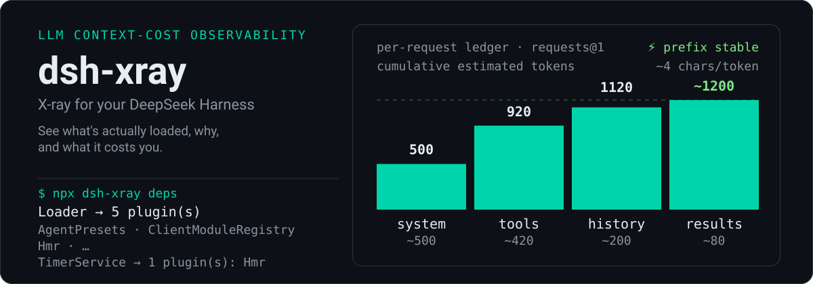

<p align="center">
  
</p>

<p align="center"><sub>token 账单面板取自仓库内 <code>fixtures/runtime-basic</code> 快照;停用级联面板是作者本机组合的示意 capture,本仓库无 fixture 可复现。</sub></p>

<p align="center">
  <a href="https://www.npmjs.com/package/dsh-xray"></a>
  <a href="https://github.com/alloevil/dsh-xray/actions/workflows/check.yml"></a>
  <a href="../LICENSE"></a>
  <a href="https://scorecard.dev/viewer/?uri=github.com/alloevil/dsh-xray"></a>
  <a href="https://codecov.io/gh/alloevil/dsh-xray"></a>
</p>

<p align="center">
  <strong>给 <a href="https://github.com/deepseek-ai/deepseek-harness">DeepSeek Harness</a> 拍 X 光</strong>——看清到底加载了什么、为什么在那、以及它悄悄花掉了你什么。
  <br>
  <em>LLM 上下文成本可观测:按插件归因 token、prompt section 与工具 schema 计价、skill catalog 常驻税、依赖停用级联。</em>
</p>

<p align="center">
  <a href="../README.md">English</a>
</p>

---

你挂载的每个插件都在悄悄向每次 LLM 请求收费:prompt sections、工具 schema、token。dsh-xray 以 **与 Chat / Trajectory 并列的 X 光标签页** 长在你运行中的 harness 里,把这份账单逐项摊开——按插件、按条目,直到具体到每一个字:


展开插件看它注册了什么;点击任何条目,读它注入每次请求的原文:

<table>
<tr>
<td width="50%">


</td>
<td width="50%">


</td>
</tr>
</table>

三次点击:插件总账 → 条目清单 → 实际文字。数字不再是你被迫相信的估算,而是你亲手核对过的事实。

---

## 问题

`dsh --dump-config` 只给你原始组合树,插件面板只给你平铺列表。它们都不回答:这个插件**为什么**在这、停用它会**连带瘫掉什么**、它在每次请求里**悄悄消耗什么**。

**dsh-xray 回答这些。** 当答案是"这个插件对每次请求收税、却没有任何东西依赖它"——`deps` 视图确认可以安全停用,一行 patch 移除它,`attribute` 验证生效。

---

<p align="center">
  
</p>

cost 视图回答一个别的工具都不问的问题:**这段上下文是谁放进来的、花掉我多少?**

- **来源归因** —— 每个 prompt section 和工具 schema 都关联到注册它的插件,实时从 registry 重建(无法唯一归因的条目诚实标注 `unattributed`,绝不猜测)。
- **按插件汇总** —— 每个插件的每请求上下文税:sections + schemas + tokens + 占比,排序呈现。
- **条目原文查看** —— `/xray/api/entry` 返回任意条目的实时文本,附字符/token 标尺。按请求现算,绝不落盘。
- **skill 成本** —— 专属视图为每个 skill 计两笔价:catalog 行(只要存在模型可调用的 skill 就随每次请求常驻)与正文(每次加载计费)。只计价——启停归生态里的 skill 管理器。
- **逐请求账单** —— 每次 LLM 调用一张分类账单:system / 工具 schema / 历史 / 工具结果(按工具聚合),**Δprev** 增量列,前缀稳定性标记(⚡ system+工具与上一请求逐字节一致——KV 缓存友好;✂ 前缀击穿)。compaction 与标题生成单独标注。只存计数、名字和 hash——绝不存消息正文。
- **界面自解释** —— 每个视图开头一句"你在看什么";术语带白话提示;整个标签页通过宿主 locale 服务双语呈现(English / 中文)。

同一份数据流经三个界面:**X 光标签页**(原生 GUI)、独立 **`/xray` 页面**(连它所诊断的 client-module 加载链路挂了都能用)、以及 **CLI**。

---

<p align="center">
  
</p>

```sh
npx dsh-xray attribute   # 每一行由哪层引入、之后被谁 patch 过
npx dsh-xray conflicts   # 有争议的字段,带每个写者的证据:file:line、写入值、赢家
npx dsh-xray diff        # 声明(静态层)vs 实际(dump-config)组合树
npx dsh-xray snapshot    # 内容寻址 lockfile;--against <lock> 对比漂移,漂移时退出码 1
npx dsh-xray deps [svc]  # 服务依赖图:提供者、消费者、传递性停用级联
npx dsh-xray health      # 插件生命周期健康:失败 fiber、等待中的注入、状态迁移史
npx dsh-xray cost        # 上下文成本:prompt sections + 工具 schema 的估算 token 占用
npx dsh-xray shadow      # 被多个插件同时提供的服务
npx dsh-xray verify      # 声明(静态)行 ↔ 运行时注册表对账,不一致退出码 1
npx dsh-xray why <tool>  # 单个工具的溯源链:注册它的插件、它的 inject、这些服务的提供者
npx dsh-xray audit       # 对 out-of-tree 插件做敏感触点静态扫描
```


治理视图与命令:

```sh
npx dsh-xray slo --json                 # Context SLO:预算检查,输出 PASS/WARN/FAIL
npx dsh-xray graph --json               # 统一 evidence graph:插件、条目、服务
npx dsh-xray impact --plugin <name>     # 只读影响评估,不会应用任何修改
```

治理命令均为只读。`--plugin` 用于指定 `impact` 的插件;不会禁用插件、写配置或应用 patch。


*演示终端内容是作者本机 `web` profile 的示意 capture(未记录 revision),数字无法由本仓库复现,且随插件增减漂移;可复现的 fixture 及其固化输出见 `fixtures/` 与 `tests/golden.spec.js`。*

`attribute`、`conflicts`、`snapshot` 是静态的——重放磁盘上的层栈,dsh 起不来时照样能跑(`snapshot` 还会采样 `dsh --dump-config` 取组合哈希;存在运行时快照时一并写入 services/tools,不存在就诚实地记为 `null`)。所有命令支持 `--profile <name>`(默认 `web`)和 `--json`;所有 JSON 输出都带版本化的 `schema` 字段(`dsh-xray/<view>@N`),机器消费方据此识别结构变化而不必猜。`snapshot` 及其 `--against` 差异、`verify`、`audit` 已升到 `@2`(变化见 changelog),其余视图仍为 `@1`。退出码可直接进 CI:`diff`(两树不一致)、`health`(有插件不健康)、`snapshot --against <lock>`(组合漂移)、`shadow`(服务被多方提供)、`verify`(声明与运行时不符)、`why`(快照里没有该工具)均返回 `1`。

---

<p align="center">
  
</p>

<table>
<tr>
<td width="50%">

### 🔍 层归因
每个活跃插件来自哪一层:内核 bundle / profile 依赖 / `cordis.patch.yml` insert / repository 源。

### 📊 声明 vs 实际 diff
装了但没生效、卸了但残留 patch 行——包括指向不存在 id 的 patch 行(dsh 会输出 stderr 警告后跳过)。

### ⚡ 冲突检测
多个插件 patch 同一配置行时,谁静默赢了。

### 📸 组合快照
把当前生效组合导出为 lockfile——bundle、patch,以及每个已安装插件的来源(`registry` / `link` / `repository`)与排除 `node_modules` 的内容哈希,外加运行时实际注册的 services 与 tools。`snapshot --against <lock>` 逐类报告漂移(bundle 版本 / patch 内容 / 包版本、来源或内容 / 服务提供者 / 工具归属与 schema 体积)并退出码 `1`。老 lock 回答不了的字段会明说,而不是被当作「一致」。

</td>
<td width="50%">

### 🌐 服务依赖图
每个服务谁提供、谁消费——以及**传递性**停用级联:不只是直接消费者,还包括它们再提供的服务的所有下游。

```console
$ npx dsh-xray deps
# disable-cascade (transitive consumers of each provider):
  Loader → 5 plugin(s): AgentPresets, ClientModuleRegistry, Hmr, …
  TimerService → 1 plugin(s): Hmr
```

*示意 capture:取自作者本机 `web` profile(未记录 revision),本仓库无 fixture 可复现,计数随插件增减漂移;仓库内的运行时 fixture 是合成输入(例如 `fixtures/runtime-basic` 固化为 `ToolRuntime → 1 plugin(s): AgentLoop`)。*

### 💊 运行时健康
每个插件的 fiber 生命周期状态、启动失败、等待中的注入、状态迁移史。

### 👥 服务遮蔽
同名注册中后来者静默胜出——通常是有意覆盖,偶尔是冲突。

### 🛡️ 能力审计
对 out-of-tree 插件的启发式静态扫描:子进程 / shell、网络外发、文件系统读与写、环境变量、动态求值。每个命中都带 `file:line` 与匹配行;每个 capability 的 confidence 由两个可核对的事实推出——导入了对应内置模块且有调用点(`high`),只有其中之一(`medium`),或只有无法交叉验证的 `process.env`(`low`)。

### 🔗 工具溯源
`why <tool>` 用一条链回答"它凭什么出现在我的上下文里":工具本身 → 归因表记录的注册插件 → 该插件的 inject → 这些服务的提供者 → 一路到不 inject 任何东西的根插件。

</td>
</tr>
</table>

---

<p align="center">
  
</p>

挂载进树后,dsh-xray 注册 `xray_composition` 工具(`view: summary | deps | health | cost | shadow | skills | requests | slo | graph | diff | impact`),agent 可以自答:

> *"我有哪些能力?" / "哪个插件提供 X?" / "为什么 Y 不可用?"*

——关于它自己。

---

<p align="center">
  
</p>

**dsh-xray 只读,不执行。**

- patch 文件里的 loader `!!js` 表达式解析为不透明标记,**绝不求值**
- CLI **从不执行**插件代码(`audit` 是对源码文本的模式扫描)
- 挂载的插件只写 `$DSH_HOME/xray/` 目录——条目原文实时返回,**绝不落盘**
- entry 端点只返回组合层文本,**绝不返回会话消息**
- 详见 [SECURITY.md](../SECURITY.md)

## 分析模式

每类结果都有明确的可信度边界:

| 模式 | 命令 | 边界 |
| --- | --- | --- |
| **静态** | `attribute`、`conflicts`、`snapshot` | 对磁盘上层栈的精确重放;dsh 起不来也能跑。`snapshot` 在 dsh 可用时还会采样 `dsh --dump-config` 取组合哈希。观测不到运行时行为。 |
| **静态 + 外呼** | `diff` | 重放层栈后,再起一个 `dsh --dump-config` 对比声明与实际。 |
| **静态 + 运行时** | `verify` | 两侧对账:声明了却没挂载的行、禁用了还在跑的行、只存在于运行时的插件、快照过期;并按服务、按工具判断其运行时提供者/归属是否落在声明行内。 |
| **运行时** | `deps`、`health`、`cost`、`shadow`、`verify` 的运行时半边、`why`、标签页、`/xray` 面板、agent 工具 | 观测自运行中的组合树(`$DSH_HOME/xray/runtime.json`),只对当前会话有效。token 为估算值(约 4 字符/token),除非你打开条目原文自己数。 |
| **启发式** | `audit` | 对源码文本的模式扫描;可能误报漏报。命中只表示"该模式出现在代码里",绝不等于"该插件是恶意的";confidence 衡量的是模式被佐证的程度,不是危险程度。 |

---

<p align="center">
  
</p>

两种用法,彼此独立:

**1. 只用静态 CLI**(不装进 dsh;dsh 起不来时照样能用):

```sh
npx dsh-xray attribute        # 需要 Node >= 22
```

**2. 挂载插件**(解锁运行时命令、X 光标签页、`/xray` 面板和 agent 工具):

```sh
dsh plugin --profile web add dsh-xray
# bundle 插件下次启动生效——重启 dsh web
```

验证生效:

```sh
dsh --profile web --dump-config | grep dsh-xray   # 组合树中出现该行
npx dsh-xray health                               # 读取运行时快照
# 然后打开任意会话点 X 光标签页,
# 或访问 http://127.0.0.1:3080/xray(web app 的默认绑定)看独立面板
```

卸载:`dsh plugin --profile web remove dsh-xray`。

| 命令 | 退出码 |
| --- | --- |
| `diff` | 两棵树不一致时 `1` |
| `health` | 有插件不健康时 `1` |
| `snapshot --against <lock>` | 组合漂移时 `1` |
| `shadow` | 服务被多方提供时 `1` |
| `verify` | 有已声明却没在运行的插件,或禁用了仍在运行的插件时 `1`(仅存在于运行时的子插件、按服务/工具的对账结果只报告,不算失败) |
| `why` | 运行时快照里没有该工具的归属记录时 `1` |

---

<p align="center">
  
</p>

对运行中组合树的诊断成像——与 [dsh-doctor](https://www.npmjs.com/package/dsh-doctor)(救援与恢复)互补。

| 能力 | 类别 |
| --- | --- |
| 上下文税归因 & 条目原文查看 | 💰 优化 |
| skill 成本(catalog 行 + 正文计价) | 💰 优化 |
| 逐请求账单(Δprev、前缀稳定性) | 💰 优化 |
| 层归因 | 🔍 检视 |
| 声明 vs 实际 diff | 🔍 检视 |
| 冲突检测 | 🔍 检视 |
| 组合快照 | 📦 导出 |
| 静态 ↔ 运行时对账 | 🔍 检视 |
| 工具溯源链 | 🔍 检视 |
| 服务依赖图 | 🌐 运行时 |
| 运行时健康 | 🌐 运行时 |
| 服务遮蔽 | 🌐 运行时 |
| Agent 自省 | 🤖 AI |
| 能力审计 | 🛡️ 安全 |

---

## 许可

[MIT](../LICENSE)
